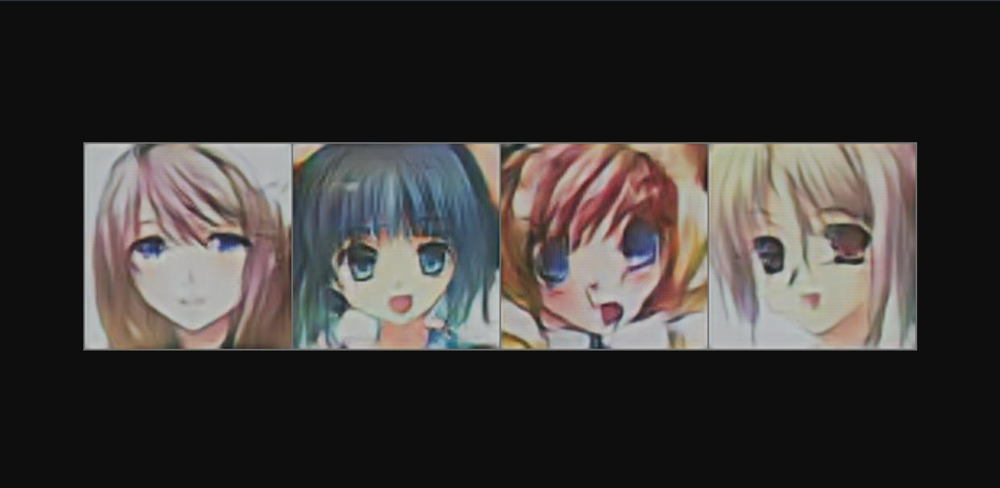
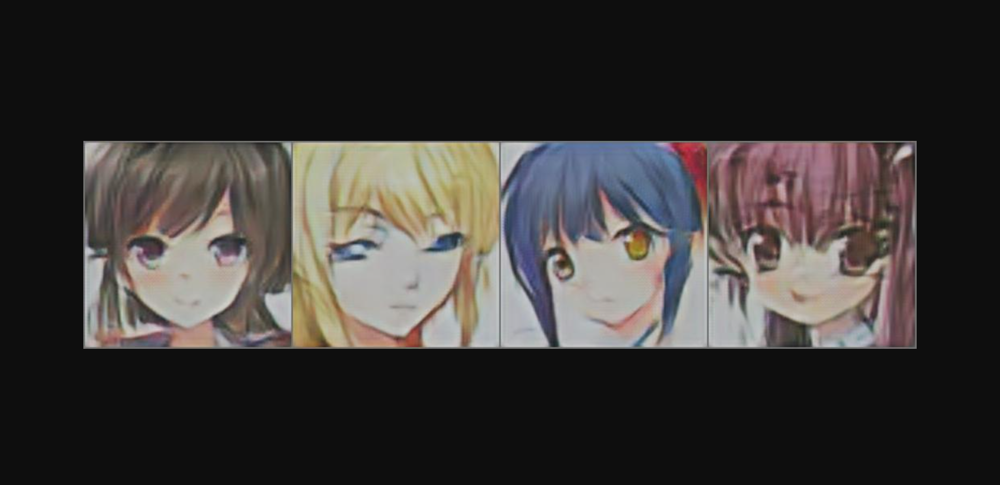

# Anime-Girl-Generator-w-GANs
 
First of all, this is a local flask website. You need to run website.py file. After that go this address http://127.0.0.1:5000/ . Every time when you reload page, there is will be new images. But it could be bad images.

This project using 2 GAN model, DCGAN and SRGAN. I used thispersondoesnotexist.com site as inspiration for this project.

For DCGAN model train Dataset https://www.kaggle.com/datasets/splcher/animefacedataset

For SRGAN model train Dataset https://press.liacs.nl/mirflickr/mirdownload.html

If you want to train your own SRGAN model, you can use my prepared Google Colab Notebook.
https://colab.research.google.com/drive/1EY9VPrr4Ggp5tqn-B7Xl61kEoCzeSxUo?usp=sharing

If you want to train your own DCGAN model, Pytorch has a page for it
https://pytorch.org/tutorials/beginner/dcgan_faces_tutorial.html

An example picture from my site

